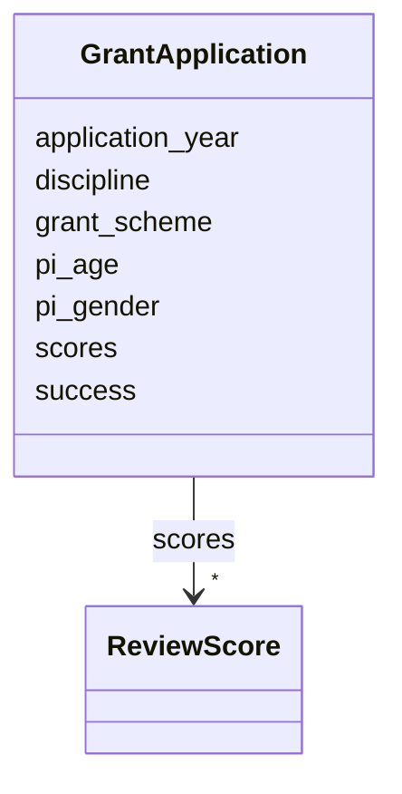

# Class: GrantApplication 


_Research grant application._


URI: [miga:GrantApplication](https://w3id.org/miga/GrantApplication)





<!-- no inheritance hierarchy -->


## Slots

| Name | Cardinality and Range | Description | Inheritance |
| ---  | --- | --- | --- |
| [pi_age](pi_age.md) | 0..1 <br/> [Integer](Integer.md) | Age of the principal investigator | direct |
| [pi_gender](pi_gender.md) | 0..1 <br/> [String](String.md) | Gender of the principal investigator | direct |
| [application_year](application_year.md) | 0..1 <br/> [Integer](Integer.md) | Year the application was submitted, or year the grant scheme was published | direct |
| [grant_scheme](grant_scheme.md) | 0..1 <br/> [String](String.md) | The funding scheme under which the grant was applied | direct |
| [discipline](discipline.md) | 0..1 <br/> [String](String.md) | Organizational division (panel, directorate, office | direct |
| [scores](scores.md) | * <br/> [ReviewScore](ReviewScore.md) | One or more scores assigned during the review process | direct |
| [success](success.md) | 0..1 <br/> [Boolean](Boolean.md) | Whether the application was successful | direct |


## Identifier and Mapping Information


### Schema Source


* from schema: https://w3id.org/miga


## Mappings

| Mapping Type | Mapped Value |
| ---  | ---  |
| self | miga:GrantApplication |
| native | miga:GrantApplication |


## LinkML Source

<!-- TODO: investigate https://stackoverflow.com/questions/37606292/how-to-create-tabbed-code-blocks-in-mkdocs-or-sphinx -->

### Direct

<details>
```yaml
name: GrantApplication
description: Research grant application.
from_schema: https://w3id.org/miga
slots:
- pi_age
- pi_gender
- application_year
- grant_scheme
- discipline
- scores
- success
tree_root: true

```
</details>

### Induced

<details>
```yaml
name: GrantApplication
description: Research grant application.
from_schema: https://w3id.org/miga
attributes:
  pi_age:
    name: pi_age
    description: Age of the principal investigator.
    from_schema: https://w3id.org/miga
    rank: 1000
    alias: pi_age
    owner: GrantApplication
    domain_of:
    - GrantApplication
    range: integer
  pi_gender:
    name: pi_gender
    description: Gender of the principal investigator.
    from_schema: https://w3id.org/miga
    close_mappings:
    - schema:gender
    rank: 1000
    alias: pi_gender
    owner: GrantApplication
    domain_of:
    - GrantApplication
    range: string
  application_year:
    name: application_year
    description: Year the application was submitted, or year the grant scheme was
      published.
    from_schema: https://w3id.org/miga
    rank: 1000
    alias: application_year
    owner: GrantApplication
    domain_of:
    - GrantApplication
    range: integer
  grant_scheme:
    name: grant_scheme
    description: The funding scheme under which the grant was applied.
    from_schema: https://w3id.org/miga
    exact_mappings:
    - schema:FundingScheme
    rank: 1000
    alias: grant_scheme
    owner: GrantApplication
    domain_of:
    - GrantApplication
    range: string
  discipline:
    name: discipline
    description: Organizational division (panel, directorate, office...) that represents
      the discipline of the application. The most granular division should always
      be preferred.
    from_schema: https://w3id.org/miga
    rank: 1000
    alias: discipline
    owner: GrantApplication
    domain_of:
    - GrantApplication
    range: string
  scores:
    name: scores
    description: One or more scores assigned during the review process. A single score
      can be interpreted as the final score.
    from_schema: https://w3id.org/miga
    rank: 1000
    alias: scores
    owner: GrantApplication
    domain_of:
    - GrantApplication
    range: ReviewScore
    multivalued: true
  success:
    name: success
    description: Whether the application was successful.
    from_schema: https://w3id.org/miga
    rank: 1000
    alias: success
    owner: GrantApplication
    domain_of:
    - GrantApplication
    range: boolean
tree_root: true

```
</details>