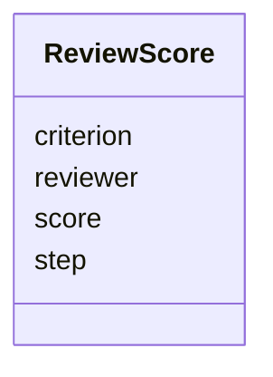

# Class: ReviewScore 


_Final score or score for a specific criterion, step, and/or reviewer._


URI: [miga:ReviewScore](https://w3id.org/miga/ReviewScore)





<!-- no inheritance hierarchy -->


## Slots

| Name | Cardinality and Range | Description | Inheritance |
| ---  | --- | --- | --- |
| [reviewer](reviewer.md) | 0..1 <br/> [String](String.md) | Anonymized identifier of the reviewer, e | direct |
| [step](step.md) | 0..1 <br/> [Integer](Integer.md) | Numeric representation of the stage or phase in the grant review process (e | direct |
| [criterion](criterion.md) | 0..1 <br/> [String](String.md) | Criterion being evaluated | direct |
| [score](score.md) | 1 <br/> [Float](Float.md) | Numeric score assigned | direct |


## Usages

| used by | used in | type | used |
| ---  | --- | --- | --- |
| [GrantApplication](GrantApplication.md) | [scores](scores.md) | range | [ReviewScore](ReviewScore.md) |


## Identifier and Mapping Information


### Schema Source


* from schema: https://w3id.org/miga


## Mappings

| Mapping Type | Mapped Value |
| ---  | ---  |
| self | miga:ReviewScore |
| native | miga:ReviewScore |
| exact | schema:Rating |


## LinkML Source

<!-- TODO: investigate https://stackoverflow.com/questions/37606292/how-to-create-tabbed-code-blocks-in-mkdocs-or-sphinx -->

### Direct

<details>
```yaml
name: ReviewScore
description: Final score or score for a specific criterion, step, and/or reviewer.
from_schema: https://w3id.org/miga
exact_mappings:
- schema:Rating
slots:
- reviewer
- step
- criterion
- score
slot_usage:
  score:
    name: score
    range: float

```
</details>

### Induced

<details>
```yaml
name: ReviewScore
description: Final score or score for a specific criterion, step, and/or reviewer.
from_schema: https://w3id.org/miga
exact_mappings:
- schema:Rating
slot_usage:
  score:
    name: score
    range: float
attributes:
  reviewer:
    name: reviewer
    description: Anonymized identifier of the reviewer, e.g. R1, R2...
    from_schema: https://w3id.org/miga
    rank: 1000
    alias: reviewer
    owner: ReviewScore
    domain_of:
    - ReviewScore
    range: string
    required: false
  step:
    name: step
    description: Numeric representation of the stage or phase in the grant review
      process (e.g. "1" for the initial screening, "2" for the panel review...).
    from_schema: https://w3id.org/miga
    rank: 1000
    alias: step
    owner: ReviewScore
    domain_of:
    - ReviewScore
    range: integer
    required: false
  criterion:
    name: criterion
    description: Criterion being evaluated.
    from_schema: https://w3id.org/miga
    rank: 1000
    alias: criterion
    owner: ReviewScore
    domain_of:
    - ReviewScore
    range: string
    required: false
  score:
    name: score
    description: Numeric score assigned.
    from_schema: https://w3id.org/miga
    rank: 1000
    alias: score
    owner: ReviewScore
    domain_of:
    - ReviewScore
    range: float
    required: true

```
</details>